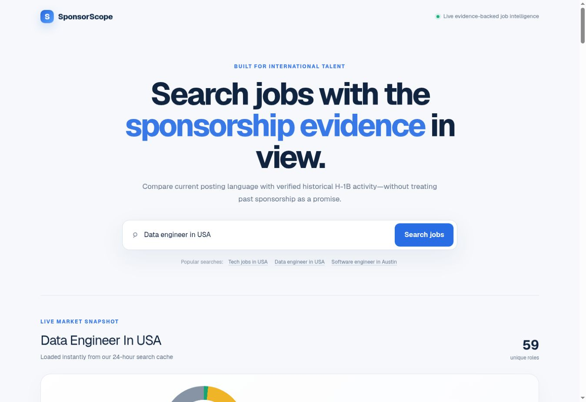
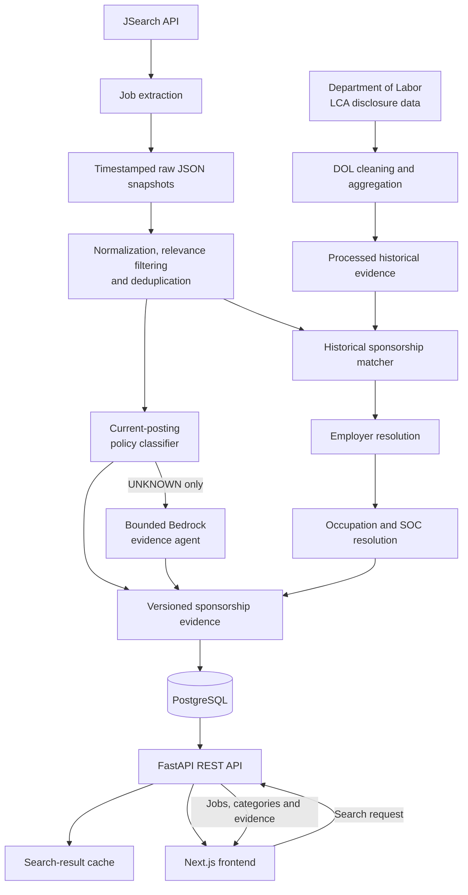

<p align="center">
  
</p>

<h1 align="center">SponsorScope</h1>

<p align="center">
  <strong>Evidence-backed sponsorship intelligence for international job seekers.</strong>
</p>

<p align="center">
  <a href="https://github.com/roflvedant/H1B-SponsorScope/actions/workflows/deploy-api-aws.yml"></a>
  
  
  
  
</p>

<p align="center">
  <a href="https://h1-b-sponsor-scope.vercel.app"><strong>Open the live application →</strong></a>
  &nbsp;·&nbsp;
  <a href="https://sp-1bbff7add6c94b48a8f5e322eddd4c9c.ecs.us-east-2.on.aws/docs">Explore the API</a>
  &nbsp;·&nbsp;
  <a href="#architecture">Architecture</a>
</p>

<p align="center">
  
</p>

SponsorScope combines language from current job postings, a bounded AI evidence
agent, and certified Department of Labor H-1B activity. It keeps current policy,
historical behavior, and uncertainty visibly separate instead of presenting
past sponsorship as a promise about a current role.

## At a glance

| Current evidence | Bounded AI | Historical context | Production engineering |
| --- | --- | --- | --- |
| Explainable rules detect explicit sponsorship, citizenship, and clearance language. | Amazon Bedrock reviews only unresolved jobs and must return verifiable quotes. | Employer and occupation matching connects jobs to certified DOL H-1B activity. | Next.js on Vercel, FastAPI on ECS, PostgreSQL, Docker, Terraform, and OIDC CI/CD. |

## Live demo

- **Application:** https://h1-b-sponsor-scope.vercel.app
- **API documentation:** https://sp-1bbff7add6c94b48a8f5e322eddd4c9c.ecs.us-east-2.on.aws/docs
- **API health:** https://sp-1bbff7add6c94b48a8f5e322eddd4c9c.ecs.us-east-2.on.aws/health

## Why this project exists

Job boards rarely expose sponsorship eligibility as structured data. Important
details are buried inside descriptions, expressed inconsistently, or omitted
entirely. Historical H-1B records can provide useful context, but employer
history alone does not prove that a particular role is eligible today.

SponsorScope addresses this by producing explainable categories:

- **Confirmed sponsorship** — the current posting explicitly offers support.
- **AI likely available/unavailable** — a bounded model found validated current
  evidence, clearly separated from deterministic confirmation.
- **Historically supported** — no current restriction was found, and the
  employer and occupation match certified historical H-1B activity.
- **Sponsorship unavailable** — the posting contains an explicit restriction.
- **Needs review** — evidence is conflicting or matching is uncertain.
- **No clear signal** — the available evidence does not justify a conclusion.

## Highlights

- Live U.S. job search through the JSearch API.
- Broad tech searches fan out across software, data engineering, analytics,
  and cloud roles before deterministic deduplication.
- Timestamped raw snapshots for reproducible processing.
- Stable job normalization and deterministic deduplication.
- Explainable rules-based sponsorship classification.
- Optional bounded Amazon Bedrock evidence agent for deterministic `UNKNOWN`
  cases, with verbatim-quote validation and no RAG.
- Employer normalization, verified aliases, and conservative fuzzy matching.
- Occupation resolution using normalized titles and DOL SOC evidence.
- Versioned classification and historical-matching results.
- PostgreSQL persistence with Alembic migrations.
- Cursor-aware cumulative search caching to reduce API usage while supporting
  20-job continuation batches.
- AWS ECS Express Mode deployment with ECR, Secrets Manager, CloudWatch logs,
  and GitHub Actions continuous delivery.
- FastAPI endpoints for search, jobs, dashboard summaries, and health checks.
- Responsive Next.js interface with category filters, evidence, and job links.
- Automated regression tests and an offline classifier evaluation workflow.

## Architecture



## Technology stack

### Backend and data pipeline

- Python 3.12
- FastAPI and Uvicorn
- Pandas and OpenPyXL
- SQLAlchemy 2
- PostgreSQL and Psycopg
- Alembic
- Pytest
- Amazon Bedrock Converse API and Amazon Nova Lite

### Frontend

- Next.js 16
- React 19
- TypeScript
- CSS

### Data sources

- JSearch for current job postings.
- U.S. Department of Labor LCA disclosure data for certified historical H-1B
  activity.

### AWS production architecture

- **ECS Express Mode:** Fargate-based FastAPI service with HTTPS, health checks,
  and one minimum task, replacing the sleeping Render free service.
- **ECR:** private, vulnerability-scanned API container images.
- **Secrets Manager:** PostgreSQL and JSearch credentials, never stored in Git.
- **CloudWatch:** ECS container and deployment logs.
- **GitHub Actions:** tests, builds, pushes immutable images, and forces a new
  ECS deployment using short-lived OIDC credentials.

Terraform configuration is stored under `infra/aws`. See
[`infra/aws/DEPLOYMENT.md`](infra/aws/DEPLOYMENT.md) for the one-time GitHub
deployment-role setup and production configuration.

## Classification evaluation

The rules-v4 classifier was evaluated against 281 reviewed examples.

| Metric | Result |
| --- | ---: |
| Overall accuracy | 97.9% |
| Definite-decision coverage | 24.9% |
| AVAILABLE F1 | 100.0% |
| UNAVAILABLE F1 | 95.4% |
| UNKNOWN F1 | 98.6% |

Accuracy and coverage answer different questions. The classifier deliberately
returns `UNKNOWN` when it cannot find explicit evidence, favoring precision and
explainability over aggressive guessing. The evaluation set is class-imbalanced
and should not be interpreted as a guarantee on every job source or occupation.

Run the evaluation locally with:

```powershell
& ".\.venv\Scripts\python.exe" -m scripts.evaluate_accuracy evaluate
```

## Bounded AI evidence agent

The optional agent is deliberately narrower than a chatbot:

1. Deterministic rules classify every posting first.
2. Only `UNKNOWN` descriptions are sent to Amazon Bedrock.
3. Nova Lite must call a typed sponsorship-assessment tool.
4. The backend verifies every quoted sentence against the original posting.
5. Low-confidence, malformed, or failed responses remain `UNKNOWN`.
6. Accepted results use separate **AI likely** labels instead of pretending to
   be deterministic confirmation.

Each invocation stores its model and prompt versions, proposed and effective
policies, evidence, confidence, latency, token counts, estimated cost, error
status, and optional human-review fields in PostgreSQL. Set
`SPONSORSHIP_AGENT_ENABLED=true` only after the ECS task role has
`bedrock:InvokeModel` permission. No vector database or RAG layer is used.

## Local setup

### 1. Clone and configure Python

```powershell
git clone https://github.com/roflvedant/H1B-SponsorScope.git
Set-Location H1B-SponsorScope

python -m venv .venv
& ".\.venv\Scripts\Activate.ps1"
pip install -r requirements.txt
```

Copy `.env.example` to `.env` and replace the JSearch placeholder:

```powershell
Copy-Item ".env.example" ".env"
```

### 2. Start PostgreSQL

Docker Desktop must be running.

```powershell
docker compose up -d postgres
docker compose ps
```

Apply the database migrations:

```powershell
& ".\.venv\Scripts\python.exe" -m alembic upgrade head
```

### 3. Prepare data

Place the DOL LCA disclosure workbook in:

```text
data/raw/dol/
```

Its filename must match:

```text
LCA_Disclosure_Data_*.xlsx
```

Fetch current jobs, process them, and load the result:

```powershell
& ".\.venv\Scripts\python.exe" fetch_main.py --pages 1
& ".\.venv\Scripts\python.exe" main.py
& ".\.venv\Scripts\python.exe" load_database.py
```

Generated raw, processed, and enriched datasets are intentionally excluded from
Git because they are reproducible and may be large.

### 4. Start FastAPI

```powershell
& ".\.venv\Scripts\python.exe" -m uvicorn app.api.main:app --reload
```

The service will be available at:

- API: `http://127.0.0.1:8000`
- Interactive documentation: `http://127.0.0.1:8000/docs`
- Health check: `http://127.0.0.1:8000/health`

### 5. Start the frontend

Create `frontend/.env.local`:

```dotenv
NEXT_PUBLIC_API_URL=http://127.0.0.1:8000
```

Then run:

```powershell
Set-Location frontend
npm install
npm run dev
```

Open `http://localhost:3000`.

## Main commands

| Command | Purpose |
| --- | --- |
| `python fetch_main.py --pages 1` | Fetch and preserve raw jobs |
| `python main.py` | Normalize, classify, and historically match jobs |
| `python load_database.py` | Upsert the newest enriched snapshot |
| `pytest -q` | Run regression tests |
| `uvicorn app.api.main:app --reload` | Start the API |
| `npm run dev` | Start the frontend |
| `npm run build` | Verify the production frontend build |

## API endpoints

| Method | Endpoint | Purpose |
| --- | --- | --- |
| `GET` | `/health` | Service health check |
| `GET` | `/jobs` | List and filter stored jobs |
| `GET` | `/dashboard` | Return category counts and percentages |
| `POST` | `/search` | Search, enrich, cache, and return jobs |

Example search request:

```json
{
  "query": "data engineer in USA",
  "max_pages": 3,
  "force_refresh": false
}
```

## Testing

```powershell
& ".\.venv\Scripts\python.exe" -m pytest -q
```

The V1 test suite covers:

- positive, negative, conflicting, and unknown sponsorship language;
- citizenship, work-authorization, H-1B transfer, and clearance wording;
- title relevance and false-positive rejection;
- SOC inference and occupation matching;
- prevention of employer-only historical false positives.

## Evidence and product boundaries

- Historical certification activity is evidence of past behavior, not a promise
  that an employer will sponsor a specific candidate or current position.
- An explicit current-posting restriction always overrides historical evidence.
- `UNKNOWN` means no conclusive language was found; it does not mean sponsorship
  is available.
- Results are informational and are not immigration or legal advice.

## Planned improvements

- Scheduled ingestion and monitoring.
- Broader reviewed evaluation data across occupations.
- Human-review tooling and a larger reviewed agent evaluation set.
- Authentication, saved searches, and alerts.
- Observability for provider latency, failures, and classifier drift.

## License

This project is currently provided for portfolio and educational use. Add a
formal open-source license before permitting redistribution.
